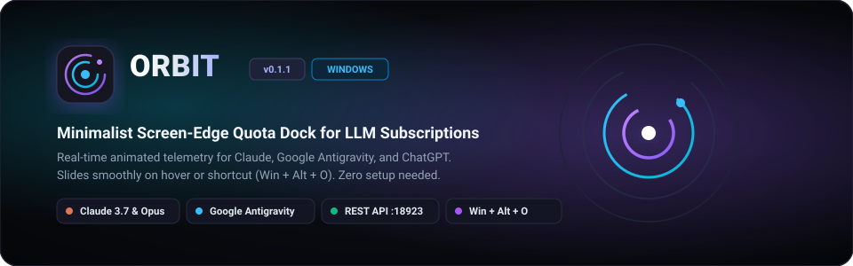
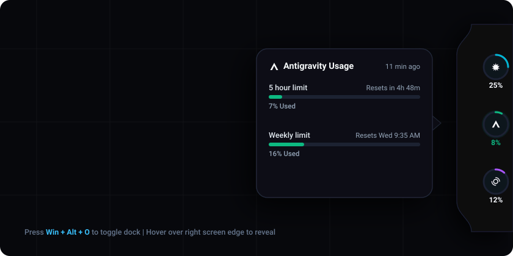
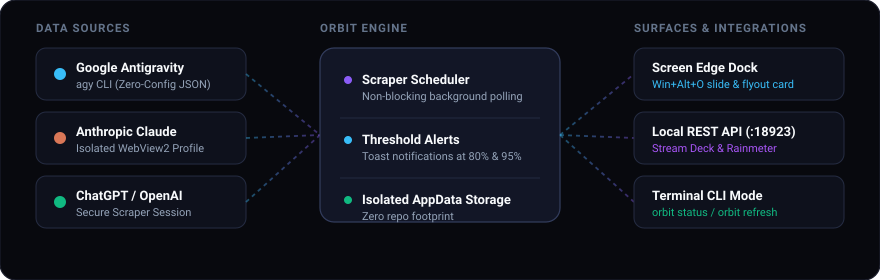

# Orbit

<p align="center">
  
</p>

<p align="center">
  <a href="https://github.com/sametgurtuna/OrbitUsage/releases"></a>
  <a href="https://dotnet.microsoft.com/download/dotnet/8.0"></a>
  
  
  
</p>

Orbit is a minimalist, non-intrusive Windows desktop widget engineered for software engineers, researchers, and AI power users. It anchors discreetly to your screen edge as an organic curved notch, providing instantaneous, real-time visual telemetry for your LLM subscription usage across **Anthropic Claude**, **Google Antigravity**, and **OpenAI ChatGPT**.

With a subtle mouse hover or global hotkey press (`Win + Alt + O`), Orbit glides into view, exposing animated radial gauges, quota exhaustion percentages, and precise reset countdown timers. Move your mouse away, and it quietly recedes into the screen edge, preserving focus and screen real estate.

<p align="center">
  
</p>

## Key Capabilities

### Organic Curved Edge Dock & Top-Center Horizontal Notch
Orbit adapts to your preferred screen edge:
* **Right-Center (Vertical Dock):** A sculpted organic dock with concave fillets attached to the right monitor edge.
* **Top-Center (Horizontal Notch / Dynamic Island):** A sleek horizontal hardware pill anchored to the top of your screen, gliding down on hover and tucking away smoothly with cubic bezier curves.

### Authentic Adaptive Visuals
Utilizes vector-rendered gauges with authentic provider brand silhouettes (Claude starburst, Antigravity delta, OpenAI swirl). In dark mode, icons render in high-contrast crisp white; in light mode, they automatically transition to refined anthracite with brand color accents.

### Intelligent Speech-Bubble Flyout
Hovering over any radial gauge summons a dedicated speech-bubble flyout card pointing directly to the active service (pointing right from the vertical dock or pointing up from the horizontal notch). It displays granular multi-tier quotas (e.g. Gemini 5-hour rolling limits vs. weekly limits), visual progress meters, and dynamic countdown timers (e.g., `Resets in 4h 48m`).

### Proactive Quota Reset & Critical Threshold Alerts
Stay ahead of subscription exhaustion:
* **Threshold Warnings (80%, 95%, 100%):** Receive desktop notifications when usage reaches critical levels.
* **Quota Reset Celebrations:** Automatically alerted with a desktop notification (`Orbit - {Service} Kotası Sıfırlandı! 🎉`) and native Windows chime sound when your quota is refreshed.
* Configurable per-service, with a built-in sound test button in Settings.

### Global Keyboard Toggle (`Win + Alt + O`)
Instantly slide the dock into view or stow it away using the customizable global shortcut. Pin and unpin buttons permit keeping the telemetry persistently pinned to your workspace during intensive coding marathons.

### Zero-Config Google Antigravity Integration
Orbit automatically resolves and monitors Google Antigravity via the official `agy` command-line utility. If Antigravity IDE is present on the machine, Orbit automatically discovers existing user credentials from the system credential vault, executing background telemetry scrapes with zero manual login required. If the CLI is not yet installed, Orbit can automatically fetch and install it in the background.

### Isolated Session Architecture for Claude & ChatGPT
For web-authenticated platforms (Claude Pro/Team, ChatGPT Plus/Team), Orbit leverages an isolated Microsoft Edge WebView2 user-data directory located under `%LOCALAPPDATA%\Orbit\WebView2`. Orbit never accesses, reads, or modifies your personal browser sessions or cookies.

### True Alt-Tab Immunity
Unlike standard WPF utility windows that accidentally clutter your Windows Task Switcher, Orbit employs native Win32 `WS_EX_TOOLWINDOW` styles combined with a persistent hidden owner window pattern. Orbit remains permanently invisible in `Alt + Tab`, living purely on the screen edge and in the Windows System Tray.

### Local REST API & Web Dashboard (`http://127.0.0.1:18923`)
An integrated HTTP server broadcasts live quota telemetry over a local REST API. Effortlessly bind live quotas into **Elgato Stream Deck** keys, **Rainmeter** desktop skins, or custom developer dashboards.

### Terminal CLI Engine (`orbit status`)
Invoking `orbit` with command-line arguments turns the binary into a high-speed CLI tool, rendering colorful ANSI progress bars directly inside Windows Terminal, PowerShell, or command prompts.

<p align="center">
  
</p>

## Installation

### Method 1: Windows Setup Installer (Recommended)

Download the latest self-contained setup installer from the [Releases](https://github.com/sametgurtuna/OrbitUsage/releases) page:

```text
OrbitSetup-v0.2.0.exe
```

The installer:
* Deploys the self-contained x64 binary (no separate .NET runtime required).
* Automatically adds Orbit to your user `PATH` so `orbit status` is globally available in any terminal.
* Configures Windows startup auto-launch (optional).
* Registers full clean uninstall capabilities in Windows Settings.

### Method 2: Build from Source

Requirements:
* Windows 10 (version 1809+) or Windows 11
* [.NET 8.0 SDK](https://dotnet.microsoft.com/download/dotnet/8.0) or newer
* Inno Setup 6 (optional, required only for compiling setup installer)

```powershell
# Clone the repository
git clone https://github.com/sametgurtuna/OrbitUsage.git
cd OrbitUsage

# Restore dependencies and build the solution
dotnet build Orbit.slnx -c Release

# Run tests
dotnet test

# Launch Orbit directly
dotnet run --project src\Orbit\Orbit.csproj -c Release
```

To compile the standalone setup installer executable:

```powershell
pwsh -File .\build-installer.ps1
```

## Getting Started

### 1. Launching Orbit
Upon launch, Orbit docks to the right screen edge of your primary monitor. A system tray icon with the Orbit logo appears in the Windows taskbar.

### 2. Service Authentication

#### Google Antigravity
* **Zero Configuration:** If Antigravity IDE or the `agy` CLI is already installed on your system, Orbit immediately begins pulling real-time usage data.
* **Auto-Provisioning:** If the CLI is not found, Orbit offers automated background installation via the official Google installation script.

#### Claude & ChatGPT
1. Right-click the Orbit dock or click the system tray icon, then choose **Settings...**
2. In the **Services** tab, click **Log into Claude...** or **Log into ChatGPT...**
3. An isolated authentication window will appear. Complete login through your standard identity provider (Google, email, SSO).
4. Once logged in, close the authentication window. Orbit securely stores session tokens in its private `%LOCALAPPDATA%\Orbit\` container and resumes automatic background polling.

## Local REST API Reference

When enabled in Settings, Orbit hosts a local REST API on `http://127.0.0.1:18923/`:

| Method | Route | Description |
| :--- | :--- | :--- |
| `GET` | `/` | Interactive responsive HTML Web Dashboard with live radial meters |
| `GET` | `/api/usage` | Complete JSON snapshot of all configured services and quotas |
| `GET` | `/api/usage/{service}` | Single-service JSON payload (`claude`, `antigravity`, `chatgpt`) |
| `GET` | `/api/ascii` | Plaintext terminal report with ANSI progress bars for `curl` |
| `GET` | `/api/status` | Aggregate system health, uptime, and service metrics |
| `POST` | `/api/refresh` | Forces an immediate background scrape cycle across all providers |

### Example Payload (`GET /api/usage/claude`)

```json
{
  "serviceKey": "claude",
  "displayName": "Claude",
  "usedPercent": 25.0,
  "displayText": "25% Used",
  "colorHex": "#D97757",
  "resetCountdownText": "in 2h 45m",
  "lastUpdated": "2026-09-03T14:10:00Z",
  "isSuccess": true,
  "quotaGroups": [
    {
      "name": "Current Session",
      "usedPercent": 25.0,
      "resetTime": "in 2h 45m"
    }
  ]
}
```

### Stream Deck Integration Guide
To map an Elgato Stream Deck key to live quota telemetry:
1. Add an **HTTP Request** or **Generic Web Action** key.
2. Set URL to `http://127.0.0.1:18923/api/usage/claude`.
3. Set Display Title / Value Path to `$.displayText`.
4. Set Key Press Action to `POST http://127.0.0.1:18923/api/refresh` for instantaneous on-demand quota refreshing.

## Command-Line Interface (CLI)

Orbit functions as a CLI command when arguments are supplied:

```powershell
# Display visual terminal quota report
orbit status

# Output structured JSON for automation scripts
orbit status --json

# Trigger an immediate background refresh cycle
orbit refresh

# Launch the interactive Settings window
orbit settings

# Display CLI help and available flags
orbit --help
```

### Example Terminal Output

```text
  ___  ____  ____  ___ _____ 
 / _ \|  _ \| __ )|_ _|_   _|
| | | | |_) |  _ \ | |  | |  
| |_| |  _ <| |_) || |  | |  
 \___/|_| \_\____/|___| |_|  v0.2.0

Claude 3.7 / Opus    [========------------]  42%  Resets in 2h 15m
Google Antigravity   [==------------------]  08%  Resets in 4h 48m
OpenAI ChatGPT       [====----------------]  18%  Resets tomorrow
```

## Settings & Configuration

Orbit stores all user configurations in `%LOCALAPPDATA%\Orbit\settings.json`.

```json
{
  "pollIntervalMinutes": 5,
  "enableThresholdAlerts": true,
  "alertThresholdPercent": 80.0,
  "theme": "Dark",
  "layout": "RightCenter",
  "targetMonitorDeviceName": "\\\\.\\DISPLAY1",
  "toggleHotkey": "Win+Alt+O",
  "enableLocalApi": true,
  "localApiPort": 18923,
  "launchAtStartup": true
}
```

* **Screen Positioning:** Choose from 7 screen positions (`RightCenter`, `RightTop`, `RightBottom`, `TopCenter`, `TopLeft`, `TopRight`, `LeftCenter`).
* **Multi-Monitor:** Select any active display detected on the machine with automatic DPI scaling.
* **Proactive Toast Alerts:** Receive desktop notifications when usage crosses critical thresholds (e.g. 80%, 95%).
* **Theme Modes:** Choose between **Dark** (Obsidian Glass) and **Light** (Clean Paper White).

## Security & Privacy Assurance

* **Zero Cloud Dependence:** Orbit does not transmit your personal data, credentials, or metrics to any third-party telemetry server. All data stays local to your workstation.
* **Isolated Browser Storage:** All web scraping runs in an isolated container (`%LOCALAPPDATA%\Orbit\WebView2`) separated from your system Edge, Chrome, or Firefox profiles.
* **Open Source & Transparent:** Fully inspectable C# codebase without obfuscation or remote executable loading.

## Project Structure

```text
usage/
├── assets/                  # High-resolution vector diagrams and app icons
├── installer/               # Inno Setup compilation scripts and configurations
│   ├── Orbit.iss            # Inno Setup v6 script definition
│   └── orbit.ico            # Multi-layer application icon
├── src/
│   └── Orbit/
│       ├── Controls/        # Radial gauges, curved dock shapes, and UI components
│       ├── Helpers/         # Win32 NativeMethods, P/Invoke, Hotkeys, Screen math
│       ├── Models/          # App settings, usage results, and theme models
│       ├── Resources/       # Embedded icons, vectors, and selector configs
│       ├── Services/        # Scrapers (agy CLI, WebView2, CDP), REST API, Tray
│       ├── ViewModels/      # MVVM Notch and Settings ViewModels
│       └── Views/           # WPF Main Dock, Settings, and Login Windows
├── tests/
│   └── Orbit.Tests/         # Comprehensive xUnit test suite (50 tests)
├── build-installer.ps1      # Automated release publisher & setup compiler
└── Orbit.slnx               # Modern Visual Studio / .NET solution
```

## License

Orbit is distributed under the terms of the [MIT License](LICENSE).
Copyright (c) 2026 Samet Gurtuna and contributors.
